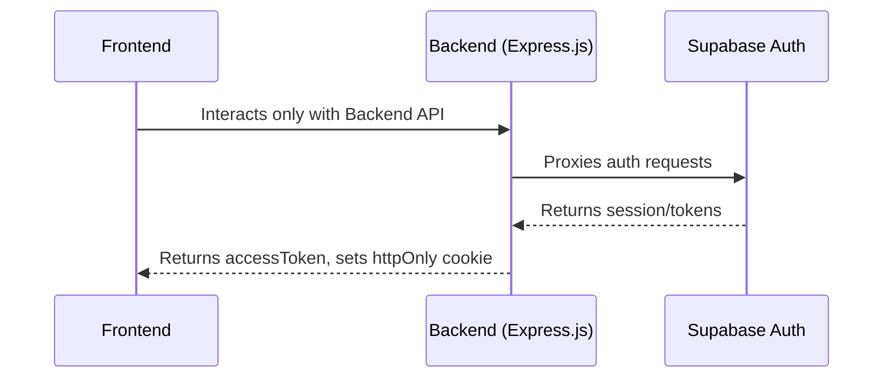
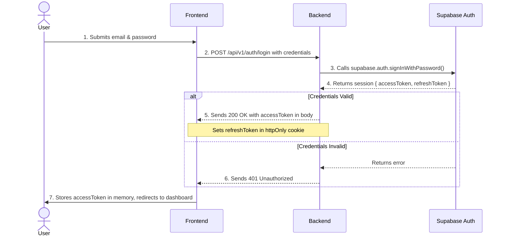
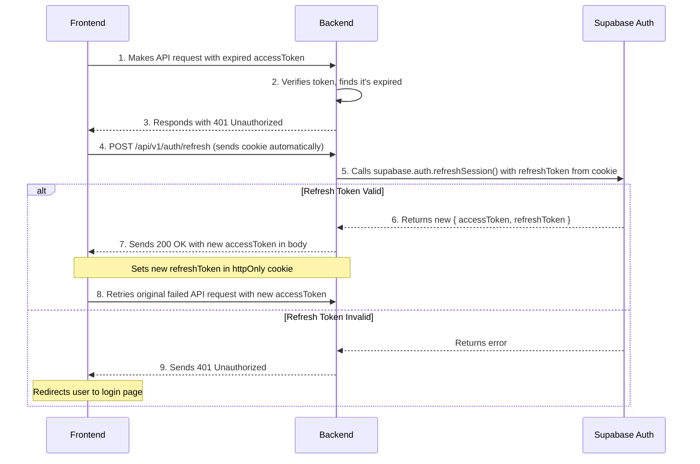

# Authentication Specification

This document details the authentication and authorization mechanism for the Janus AI application, using a Backend-for-Frontend (BFF) pattern with Supabase Auth.

## 1. Core Principles

-   **Security**: The primary goal is to secure user data by minimizing the exposure of sensitive tokens to the client-side. The long-lived `refreshToken` is never stored in the browser's local storage.
-   **Separation of Concerns**: The frontend is completely decoupled from the authentication provider (Supabase). It only needs to know about the backend's API endpoints.
-   **Control**: The backend acts as a gatekeeper, giving us full control over authentication logic, rate limiting, and logging.

## 2. Architecture Overview

The authentication flow involves three main actors: the **Frontend** (React app), the **Backend** (Express.js server), and **Supabase Auth**. The backend serves as a trusted proxy between the frontend and Supabase.

## 3. Endpoints

All endpoints are prefixed with `/api/v1`.

### `POST /auth/register`

-   **Description**: Registers a new user.
-   **Request Body**: `{ "email": "user@example.com", "password": "strongpassword123" }`
-   **Success Response (201)**:
    -   **Body**: `{ "accessToken": "...", "user": { ... } }`
    -   **Cookie**: Sets `refreshToken` in an `httpOnly`, `secure` cookie.

### `POST /auth/login`

-   **Description**: Authenticates an existing user.
-   **Request Body**: `{ "email": "user@example.com", "password": "strongpassword123" }`
-   **Success Response (200)**:
    -   **Body**: `{ "accessToken": "...", "user": { ... } }`
    -   **Cookie**: Sets `refreshToken` in an `httpOnly`, `secure` cookie.

### `POST /auth/refresh`

-   **Description**: Issues a new `accessToken` using the `refreshToken` from the cookie.
-   **Request Body**: (empty)
-   **Success Response (200)**:
    -   **Body**: `{ "accessToken": "..." }`
    -   **Cookie**: Sets a new `refreshToken` in the cookie.

### `POST /auth/logout`

-   **Description**: Logs the user out.
-   **Request Body**: (empty)
-   **Success Response (204)**: No content. The `refreshToken` cookie is cleared.

## 4. Detailed Flows

### User Login Flow

This diagram illustrates the step-by-step process when a user logs in.

### Access Token Refresh Flow

This flow occurs when the `accessToken` expires and the frontend needs a new one to continue making authenticated requests.

## 5. Authorization

-   **Token Verification**: A middleware on the Express server will validate the `accessToken` on every protected request by calling `supabase.auth.getUser(token)`.
-   **Data Access**: The user's identity (`user.id`) from the validated token is attached to the request object (`req.user`). This ID is then used to scope all subsequent database queries.
-   **Database Security (RLS)**: Supabase's Row Level Security (RLS) will be enabled on all sensitive tables. RLS policies will ensure that database operations are only allowed if the `user_id` of the row matches the `auth.uid()` of the authenticated user, providing a critical layer of defense directly at the database level.
